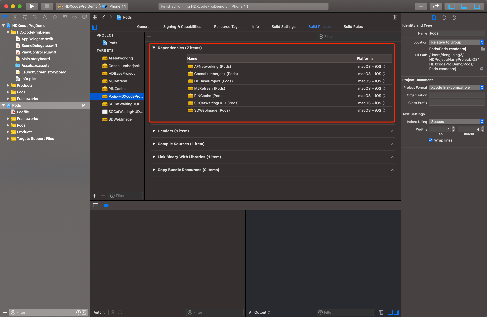
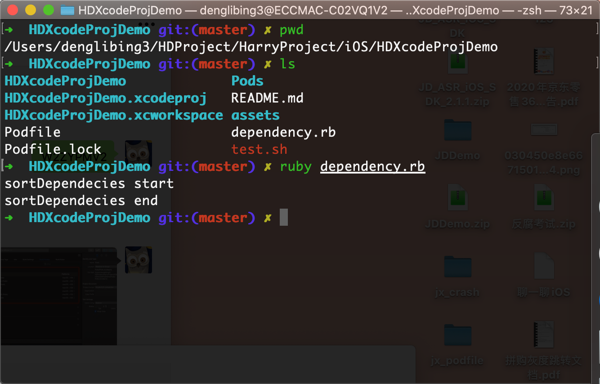
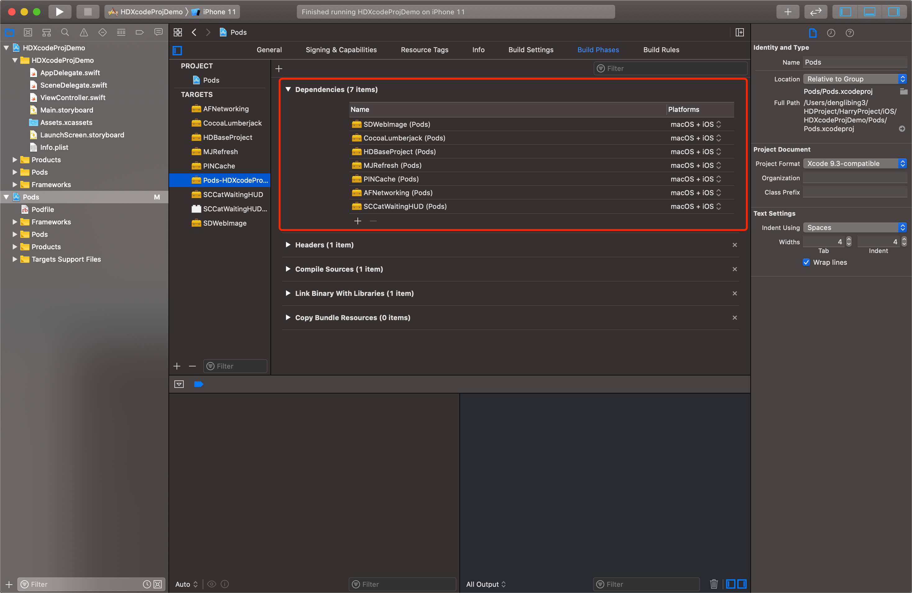

### 使用Xcodeproj修改依赖库顺序


> 基于某种特定的需求，需要动态的按照特定的顺序来对项目依赖的库进行排序，得知 Cocoapods 团队大佬已经开发了 Xcodeproj 来管理工程的配置，所以本次记录一下使用 Xcodeproj 来完成我的目的


#### 具体的代码如下：

```ruby
require 'xcodeproj'

def priorityDependencesFunction(dependencies)
    # 自定义依赖排序库（下面的排序优先级最高）
    priorityDependences = ["SDWebImage", "CocoaLumberjack",
        "HDBaseProject", "MJRefresh", "PINCache",
        "AFNetworking"]

    # 将工程所有依赖组件移除，并按照priorityDependences的顺序加入到deleteDependences中
    deleteDependences = []
    for dependencyName in priorityDependences do
        for dependency in dependencies do
            if dependencyName == dependency.name
                deleteDependences << dependency
                break
            end
        end
    end

    # dependencies删除deleteDependences的元素
    dependencies.delete_if { |dependency|
        deleteDependences.include?(dependency)
    }

    # 将deleteDependences插入到最前面
    for deleteDependency in deleteDependences.reverse do
        dependencies.unshift(deleteDependency)
    end
end


def sortDependecies()
    puts "sortDependecies start"
    # 当前路径
    base_path = File.dirname(__FILE__)
    project_path = base_path + '/Pods/Pods.xcodeproj'
    pod_project = Xcodeproj::Project.open(project_path)
    pod_target = nil
    pod_project.targets.each_with_index do |target, index|
        if target.name  == "Pods-HDXcodeProjDemo"
            pod_target = target
        end
    end
    priorityDependencesFunction(pod_target.dependencies)
    pod_project.save
    puts "sortDependecies end"
end

sortDependecies()
```


#### 执行步骤：

1、可以选择下载 [测试工程](https://github.com/erduoniba/HDXcodeProjDemo) ，然后 `pod install` 安装，项目依赖库的顺序默认是按照字母排序

 


2、在项目路径下，执行 `ruby dependency.rb` ，实现自定义依赖库排序

 


3、最终效果

 


#### 参考资料

[Xcodeproj](https://github.com/CocoaPods/Xcodeproj) 

[利用xcodeproj给主工程添加子工程](https://www.jianshu.com/p/8f4d1de45ef7)

